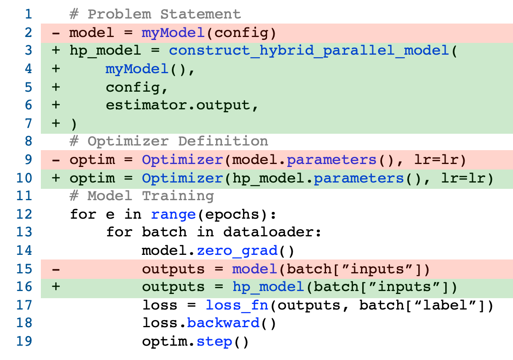

# Galvatron
Galvatron: Efficient Transformer Training over Multiple GPUs Using Automatic Parallelism

## Environment Setup
Run the following script to prepare the conda environment:
``` shell
sh prepare_env.sh
```

## Usage
### Training with Galvatron
Galvatron provides a simple way to train Transformer models in layerwise hybrid parallel fashion. We provide four models as examples in this repo, including BERT, T5, ViT, Swin Transformer, and provide scripts to train these models on single GPU or on multiple GPUs using hybrid parallel strategy. 

It is fairly simple to construct a layerwise hybrid parallel model in Galvatron, which only requires a few modification to the training scripts on single GPU.
<div align=center>  </div>

In the model directory ```bert, t5, vit, swin```, to train the model on single GPU, run:
``` shell
sh scripts/train_xxx.sh
```
To train the model on multiple GPUs, run:
``` shell 
sh scripts/train_xxx_hp_layerwise.sh
```
We support both global hybrid parallel strategy and layerwise hybrid parallel strategy, which can be easily specified by modifying only a few arguments or a few lines of codes. Enter the corresponding directory to see detailed guidance.

### Searching with Galvatron
To search the optimal layerwise hybrid parallel strategy on the given device, please first enter ```test_env``` directory, run the environment tests according to the guidance and obtain communication coefficient, overlap coefficient and forward computation time on the given device, and modify the corresponding values in ```search_layerwise_hp.py```. Then enter the model directory and run the following scripts to search for the optimal strategy for the given Transformer model:

``` shell
sh scripts/search_layerwise_hp.sh
```
Given the memory budget, Galvatron provides the layerwise hybrid parallel strategy with maximum throughput. User can train the model with the provided optimal strategy using ```train_hp_layerwise.py``` to obtain the optimal throughput.
